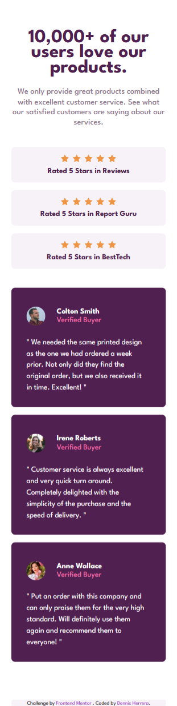
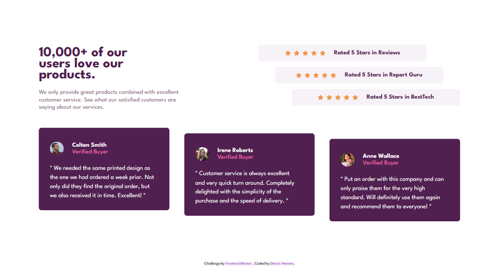

# Frontend Mentor - Social proof section solution

This is a solution to the [Social proof section challenge on Frontend Mentor](https://www.frontendmentor.io/challenges/social-proof-section-6e0qTv_bA). Frontend Mentor challenges help you improve your coding skills by building realistic projects. 

## Table of contents

- [Overview](#overview)
  - [The challenge](#the-challenge)
  - [Screenshot](#screenshot)
  - [Links](#links)
- [My process](#my-process)
  - [Built with](#built-with)
  - [What I learned](#what-i-learned)
  - [Useful resources](#useful-resources)
- [Author](#author)

## Overview

### The challenge

Users should be able to:

- View the optimal layout for the section depending on their device's screen size

### Screenshot





### Links

- [Live site](https://klonnister.github.io/Social-proof-page)

## My process

### Built with

- Semantic HTML5 markup
- CSS custom properties
- Flexbox
- Mobile-first workflow

### What I learned

I used @import in CSS for the first time and learned how to add different font weights to my projects:

```css
  @import url('https://fonts.googleapis.com/css2?family=League+Spartan:wght@400;500;700&display=swap');

  body {
    font-weight: 400;
    font-family: 'League Spartan', sans-serif;
  }
```

### Useful resources

- [Stack overflow article about using font weights](https://stackoverflow.com/questions/40544991/using-different-font-weight-of-the-same-google-font-in-css#:~:text=Use%20the%20font-weight%20property%20http%3A%2F%2Fwww.w3schools.com%2Fcssref%2Fpr_font_weight.asp%20Example%3A%20p.normal%20%7B,font-weight%3A%20bold%3B%20%7D%20p.thicker%20%7B%20font-weight%3A%20900%3B%20%7D)

## Author

- Frontend Mentor - [Klonnister](https://www.frontendmentor.io/profile/Klonnister)
- Instagram - [dennis_herrera_f](https://www.instagram.com/dennis_herrera_f/)